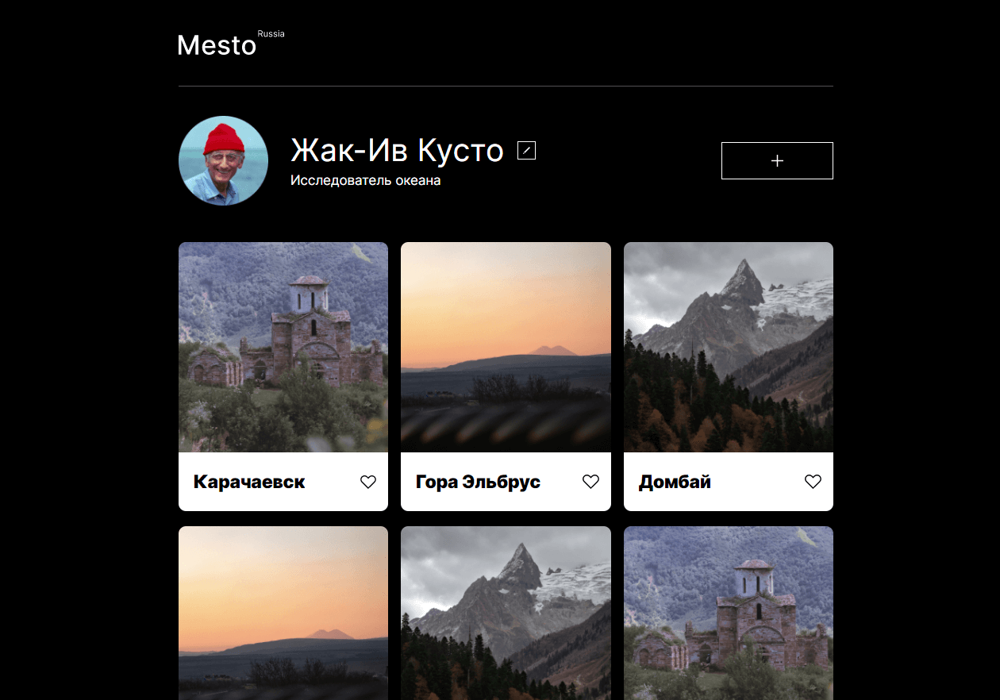

# Mesto

#### _Интерактивная страница, куда можно добавлять фотографии, удалять их и ставить лайки_

link: https://vgaidukov.github.io/react-mesto-auth/

## Содержание проекта:

- Информация о профиле
- Лента фотографий
- Регистрация и авторизация пользователей

## Автор проекта:

#### Вадим Гайдуков

### Проект реализован с применением следующих технологий:
- структурирование проекта по принципу ООП  
- JavaScript  
- React
- работа приложения по принципам REST API
  
- использование модальных окон
- работа с формами
- валидация форм
  
- флексбокс-верстка
- grid-layout
- позиционирование
- анимация
- адаптивная верстка, медиазапросы
- структурирование проекта по правилам Nested БЭМ

## Preview :

